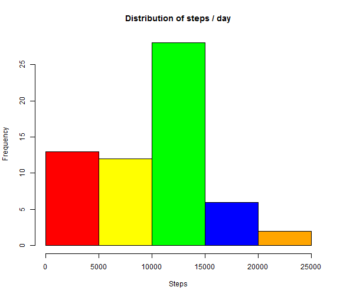
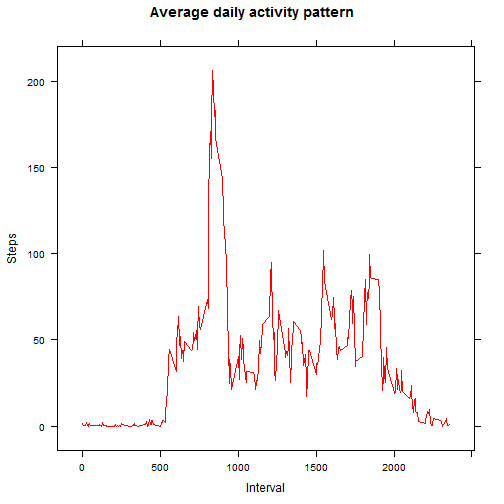
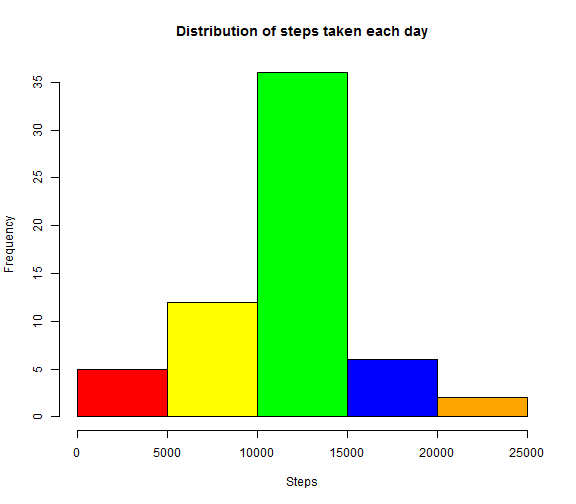
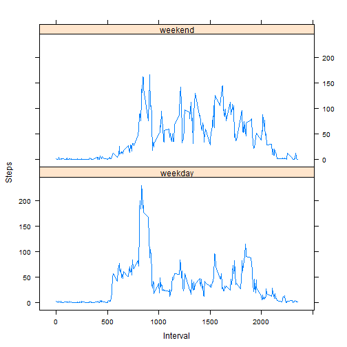

# Reproducible Research: Peer assessment 1

## Loading and preprocessing the data


```r
unzip("activity.zip")
dati <- read.csv("activity.csv",sep=",")

dati$date   <- as.Date(dati$date)
dati$hour   <- dati$interval %/% 100
dati$minute <- dati$interval %%  100
dati$DateTime <- strptime(paste(dati$date, dati$hour, dati$minute), format="%Y-%m-%d %H %M")
```


```r
summary(dati)
```

```
##      steps           date               interval         hour     
##  Min.   :  0    Min.   :2012-10-01   Min.   :   0   Min.   : 0.0  
##  1st Qu.:  0    1st Qu.:2012-10-16   1st Qu.: 589   1st Qu.: 5.8  
##  Median :  0    Median :2012-10-31   Median :1178   Median :11.5  
##  Mean   : 37    Mean   :2012-10-31   Mean   :1178   Mean   :11.5  
##  3rd Qu.: 12    3rd Qu.:2012-11-15   3rd Qu.:1766   3rd Qu.:17.2  
##  Max.   :806    Max.   :2012-11-30   Max.   :2355   Max.   :23.0  
##  NA's   :2304                                                     
##      minute      DateTime                  
##  Min.   : 0   Min.   :2012-10-01 00:00:00  
##  1st Qu.:14   1st Qu.:2012-10-16 05:58:45  
##  Median :28   Median :2012-10-31 11:57:30  
##  Mean   :28   Mean   :2012-10-31 11:30:49  
##  3rd Qu.:41   3rd Qu.:2012-11-15 17:56:15  
##  Max.   :55   Max.   :2012-11-30 23:55:00  
## 
```

## What is mean total number of steps taken per day?

First we calculate the total number of steps taken per day


```r
stepsaggr <- tapply(dati$steps, dati$date, sum, na.rm=TRUE)
```

We create the histogram of the total number of steps taken each day.


```r
colors = c("red", "yellow", "green", "blue", "orange") 
hist(stepsaggr, main="Distribution of steps / day", col=colors, xlab="Steps")
```



Finally we calculate and report the mean and median of the total number of steps taken per day.


```r
sommario <- summary(stepsaggr)
```

Steps / day:
* mean: 9350
* median: 10400

## What is the average daily activity pattern?

Time series plot of the 5-minute interval (x) and the average number of steps taken, averaged across all days (y).


```r
mediaintervalli <- tapply(dati$steps, dati$interval, mean, na.rm = TRUE)
disponibile <- require(lattice)
if (disponibile == FALSE) 
     {
      install.packages("lattice")
      library(lattice)
     }
xyplot(mediaintervalli ~ sort(unique(unclass(dati$interval))), type = "l", col = "red", xlab = "Interval", ylab = "Steps", main="Average daily activity pattern")
```



Determine the 5-minute interval with the highest average total steps.


```r
maxIntervallo <- mediaintervalli[abs(mediaintervalli - max(mediaintervalli)) < 1]
```

The interval with the maximum average number of steps is 835.

## Imputing missing values

Calculate and report the total number of missing values in the dataset (i.e. the total number of rows with NAs).


```r
mancanti <-length((dati$steps[which(is.na(dati$steps)==TRUE)]))
```

The total number of missing values is 2304.

Strategy for filling in all of the missing values in the dataset: replaced missing values with the mean number of steps for each 5-minute interval. 


```r
intervalloMedia <-as.data.frame(tapply(dati$steps,dati$interval,mean,na.rm=TRUE))
names(intervalloMedia)<-c("steps")
```

New dataset that is equal to the original dataset but with the missing data filled in.


```r
dati[is.na(dati)] = intervalloMedia$steps
dati$steps<-round(dati$steps,0)
summary(dati)
```

```
##      steps          date               interval         hour     
##  Min.   :  0   Min.   :2012-10-01   Min.   :   0   Min.   : 0.0  
##  1st Qu.:  0   1st Qu.:2012-10-16   1st Qu.: 589   1st Qu.: 5.8  
##  Median :  0   Median :2012-10-31   Median :1178   Median :11.5  
##  Mean   : 37   Mean   :2012-10-31   Mean   :1178   Mean   :11.5  
##  3rd Qu.: 27   3rd Qu.:2012-11-15   3rd Qu.:1766   3rd Qu.:17.2  
##  Max.   :806   Max.   :2012-11-30   Max.   :2355   Max.   :23.0  
##      minute      DateTime                  
##  Min.   : 0   Min.   :2012-10-01 00:00:00  
##  1st Qu.:14   1st Qu.:2012-10-16 05:58:45  
##  Median :28   Median :2012-10-31 11:57:30  
##  Mean   :28   Mean   :2012-10-31 11:30:49  
##  3rd Qu.:41   3rd Qu.:2012-11-15 17:56:15  
##  Max.   :55   Max.   :2012-11-30 23:55:00
```

Histogram of the total number of steps taken each day and mean and median total number of steps taken per day. 


```r
colors = c("red", "yellow", "green", "blue", "orange") 
hist(tapply(dati$steps, dati$date,sum,na.rm=FALSE), col=colors,
     main="Distribution of steps taken each day",
     xlab="Steps")
```



```r
meanNA<-mean(tapply(na.omit(dati$steps),dati$date,sum,na.rm=FALSE))
medianNA<-median(tapply(na.omit(dati$steps),dati$date,sum,na.rm=FALSE))
```

These values are higher than the estimates from the first part of the assignment. After changing the NA with the interval mean now the new mean is 10765.64 and the new median is 10762.
Also the histogram is roughly the same.

# Are there differences in activity patterns between weekdays and weekends?

We use the dataset with the filled-in missing values.
We create a new factor variable in the dataset with two levels - "weekday" and "weekend" indicating whether a given date is a weekday or weekend day.
Finally we make a panel plot containing a time series plot of the 5-minute interval (x) and the average number of steps taken, averaged across all weekday days or weekend days (y). 


```r
Sys.setlocale("LC_TIME", "English")
```

```
## [1] "English_United States.1252"
```

```r
dati$date<-as.Date(dati$date)
dati$weekday<-weekdays(dati$date)
dati$weekday[dati$weekday=="Monday" | 
                 dati$weekday=="Tuesday" | 
                 dati$weekday=="Wednesday" | 
                 dati$weekday=="Thursday" | 
                 dati$weekday=="Friday" ]<-"weekday"
dati$weekday[dati$weekday=="Saturday" | dati$weekday=="Sunday"]<-"weekend"
dati$weekday<-factor(dati$weekday)
intAvgWeekday<-aggregate(steps ~ interval + weekday, data = dati, FUN= "mean" )

xyplot(intAvgWeekday$steps~intAvgWeekday$interval | intAvgWeekday$weekday, 
       type="l",
       layout=c(1,2),
       xlab="Interval", 
       ylab="Steps")
```




We can see that during the weekend people walks a little more than during weekdays.
